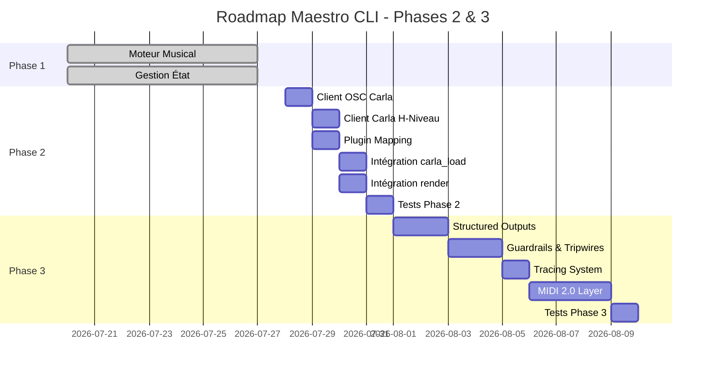

# Product Requirements Document (PRD) - Phases 2 & 3
## Maestro CLI: Bridge Carla & Système Agentique

---

## 📋 Table des Matières

1. [Contexte et Objectifs](#-contexte-et-objectifs)
2. [Roadmap Globale](#-roadmap-globale)
3. [Phase 2: Bridge Carla - PRD Détaillé](#-phase-2-bridge-carla---prd-détaillé)
4. [Phase 3: Système Agentique - PRD Détaillé](#-phase-3-système-agentique---prd-détaillé)
5. [User Stories](#-user-stories)
6. [Critères d'Acceptation](#-critères-dacceptation)
7. [Spécifications Techniques](#-spécifications-techniques)
8. [Dépendances et Prérequis](#-dépendances-et-prérequis)
9. [Livrables Attendus](#-livrables-attendus)
10. [Timeline et Priorités](#-timeline-et-priorités)

---

## 🎯 Contexte et Objectifs

### Problématique
La **Phase 1** du projet Maestro CLI est **terminée** avec succès :
- ✅ Moteur musical symbolique fonctionnel
- ✅ Pipeline de base (compose → arrange → orchestrate → critique → repair)
- ✅ Gestion d'état complète (SQLite + JSON)
- ✅ Génération de fichiers MIDI
- ✅ Reprise, rollback, historique

**Problème actuel :** Les fichiers MIDI générés **ne peuvent pas être joués** car le bridge vers Carla (ou FluidSynth en fallback) **n'est pas implémenté**.

### Objectifs Globaux

| Phase | Objectif Principal | Résultat Attendu |
|-------|---------------------|------------------|
| **Phase 2** | Rendre le pipeline **jouable** | Morceau MIDI → Audio WAV via Carla/FluidSynth |
| **Phase 3** | Rendre le système **agentique et robuste** | Contrôle intelligent, MIDI 2.0, traçabilité |

### Cible Utilisateur
- **Musiciens** : Qui veulent composer via CLI sans DAW
- **Développeurs** : Qui veulent étendre le système
- **Agents IA** : Qui doivent comprendre ce qu'il reste à faire

---

## 🗺️ Roadmap Globale



---

## 🚀 Phase 2: Bridge Carla - PRD Détaillé

### 📌 Objectif de la Phase 2
**Rendre le pipeline musical jouable et auditionnable** en implémentant le bridge vers Carla (ou FluidSynth en fallback) pour :
1. Charger des plugins VST/LV2/SF2
2. Router les pistes MIDI
3. Effectuer le rendu audio
4. Gérer les erreurs et fallbacks

### 🎯 Livrables de la Phase 2

| Livrable | Description | Critère de Succès |
|----------|-------------|------------------|
| `carla_osc.py` | Client OSC bas-niveau pour Carla | Peut envoyer/recevoir des messages OSC |
| `carla_client.py` | Client haut-niveau pour Carla | Peut charger plugins, presets, router, rendre |
| `presets.py` | Gestion des presets et configurations | Charge/Sauvegarde les configurations de rack |
| `plugin_map.json` | Mapping rôle → plugin → preset | Permet de mapper tracks.json → rack Carla |
| `carla_load` mis à jour | Commande CLI fonctionnelle | Charge un rack Carla à partir de tracks.json |
| `render` mis à jour | Commande CLI fonctionnelle | Produit un vrai WAV à partir des MIDI |
| `play` mis à jour | Commande CLI fonctionnelle | Joue le WAV produit |
| Tests d'intégration | Suite de tests complète | Tous les tests passent |

---

### 📋 Spécifications Fonctionnelles Phase 2

#### 2.1. Client OSC Bas-Niveau (`carla_osc.py`)

**Fonction :** Wrapper autour de `python-osc` pour communiquer avec Carla.

**Requirements :**
```python
class CarlaOSCClient:
    def __init__(self, host: str = "127.0.0.1", port: int = 9001):
        """Initialise la connexion OSC vers Carla"""
        
    def send(self, address: str, *args: Any) -> bool:
        """Envoie un message OSC à Carla"""
        # Addresses Carla : 
        # /carla/load-plugin
        # /carla/load-preset  
        # /carla/connect
        # /carla/render
        # /carla/start
        # /carla/stop
        
    def is_connected(self) -> bool:
        """Vérifie que Carla répond sur le port OSC"""
        
    def start_carla(self, server_port: int = 9002) -> bool:
        """Démarre le serveur Carla (optionnel)"""
        # Commande : carla --server --osc-port 9001 --server-port 9002
```

**Critères d'Acceptation :**
- [ ] Peut envoyer des messages OSC à Carla
- [ ] Peut détecter si Carla est en cours d'exécution
- [ ] Gère les timeouts (5 secondes par défaut)
- [ ] Gère les erreurs de connexion
- [ ] Logge toutes les communications OSC

---

#### 2.2. Client Carla Haut-Niveau (`carla_client.py`)

**Fonction :** API haut-niveau pour contrôler Carla.

**Requirements :**
```python
class CarlaClient:
    def __init__(self, host: str = "127.0.0.1", port: int = 9001):
        """Initialise avec le client OSC"""
        
    # ========== GESTION DU SERVER ==========
    def is_running(self) -> bool:
        """Vérifie si Carla tourne déjà"""
        
    def start(self) -> bool:
        """Démarre Carla si ce n'est pas déjà fait"""
        
    def stop(self) -> bool:
        """Arrête Carla proprement"""
        
    # ========== GESTION DES PLUGINS ==========
    def load_plugin(
        self, 
        slot: int, 
        plugin_path: str, 
        plugin_format: str = "VST3"
    ) -> dict:
        """
        Charge un plugin dans un slot
        Returns: {"slot": int, "name": str, "loaded": bool, "error": str}
        """
        
    def unload_plugin(self, slot: int) -> bool:
        """Décharge un plugin"""
        
    def load_preset(self, slot: int, preset_path: str) -> bool:
        """Charge un preset pour un plugin"""
        
    def get_plugin_info(self, slot: int) -> dict:
        """Récupère les infos d'un plugin chargé"""
        
    def list_plugins(self) -> list:
        """Liste tous les plugins disponibles"""
        
    # ========== GESTION DU RACK ==========
    def load_rack(self, rack_config: dict) -> dict:
        """
        Charge un rack complet à partir d'une configuration
        
        rack_config = {
            "plugins": [
                {"slot": 1, "path": "/path/to/plugin.vst3", "preset": "preset.fxp"},
                {"slot": 2, "path": "/path/to/bass.vst3"}
            ],
            "routes": [
                {"track": "keys_main", "slot": 1, "channel": 0},
                {"track": "bass_main", "slot": 2, "channel": 0}
            ]
        }
        """
        
    def save_rack_state(self, filepath: str) -> bool:
        """Sauvegarde l'état du rack dans un fichier"""
        
    def load_rack_state(self, filepath: str) -> bool:
        """Charge un état de rack sauvegardé"""
        
    # ========== ROUTAGE ==========
    def connect(self, input_port: int, output_slot: int) -> bool:
        """Connecte un port d'entrée à un slot de sortie"""
        
    def disconnect(self, input_port: int, output_slot: int) -> bool:
        """Déconnecte un port"""
        
    def get_connections(self) -> list:
        """Liste toutes les connexions"""
        
    # ========== RENDU ==========
    def render(self, output_path: str, duration: float = None) -> dict:
        """
        Déclenche le rendu audio
        Returns: {"status": "started"|"completed"|"failed", "output_path": str, "error": str}
        """
        
    def is_rendering(self) -> bool:
        """Vérifie si un rendu est en cours"""
        
    def cancel_render(self) -> bool:
        """Annule le rendu en cours"""
        
    # ========== TRANSPORT ==========
    def play(self) -> bool:
        """Démarre la lecture"""
        
    def stop(self) -> bool:
        """Arrête la lecture"""
        
    def pause(self) -> bool:
        """Met en pause"""
        
    # ========== ÉTAT ==========
    def get_state(self) -> dict:
        """Récupère l'état complet du rack"""
        
    def get_volume(self, slot: int) -> float:
        """Récupère le volume d'un slot"""
        
    def set_volume(self, slot: int, volume: float) -> bool:
        """Définir le volume d'un slot (0.0 - 1.0)"""
        
    def get_parameter(self, slot: int, param_index: int) -> float:
        """Récupère la valeur d'un paramètre"""
        
    def set_parameter(self, slot: int, param_index: int, value: float) -> bool:
        """Définir la valeur d'un paramètre"""
```

**Critères d'Acceptation :**
- [ ] Peut démarrer/arrêter Carla
- [ ] Peut charger/décharger des plugins VST3/LV2/SF2
- [ ] Peut charger des presets
- [ ] Peut router les pistes MIDI vers les plugins
- [ ] Peut déclencher un rendu et capturer le résultat
- [ ] Gère les erreurs (plugin introuvable, preset manquant, etc.)
- [ ] Retourne des structures de données claires et typées

---

#### 2.3. Gestion des Presets (`presets.py`)

**Fonction :** Chargement, validation et gestion des configurations de plugins.

**Requirements :**
```python
class PresetManager:
    def __init__(self, presets_dir: str = "presets"):
        """Initialise avec le dossier des presets"""
        
    def load_plugin_map(self, style: str = "gospel") -> dict:
        """
        Charge le mapping des plugins pour un style
        
        Returns: {
            "mappings": [
                {
                    "role": "keys",
                    "plugin": "EPiano",
                    "format": "VST3", 
                    "path": "/usr/lib/vst3/EPiano.vst3",
                    "preset": "Warm Suitcase",
                    "default_slot": 1,
                    "volume": 0.8,
                    "pan": 0.5
                }
            ],
            "fallback": {
                "enabled": True,
                "synth": "fluidsynth",
                "soundfont": "/usr/share/sounds/sf2/GeneralUser_GS.sf2"
            }
        }
        """
        
    def find_plugin(self, role: str, style: str = "gospel") -> Optional[dict]:
        """Trouve un plugin pour un rôle donné"""
        
    def validate_rack(self, tracks: list) -> tuple[bool, list]:
        """
        Valide qu'un rack peut être construit pour les pistes données
        Returns: (is_valid, list_of_errors)
        """
        
    def build_rack_config(self, tracks: list, style: str = "gospel") -> dict:
        """
        Construit une configuration de rack à partir de tracks.json
        
        Input: [
            {"name": "keys_main", "role": "keys", "midi_file": "keys.mid"},
            {"name": "bass_main", "role": "bass", "midi_file": "bass.mid"}
        ]
        
        Output: {
            "plugins": [...],
            "routes": [...],
            "metadata": {"style": "gospel", "project_id": "my_song"}
        }
        """
        
    def list_styles(self) -> list:
        """Liste tous les styles disponibles"""
        
    def list_roles(self, style: str = "gospel") -> list:
        """Liste tous les rôles pour un style"""
```

**Critères d'Acceptation :**
- [ ] Peut charger des mappings de plugins depuis JSON
- [ ] Valide que tous les plugins existent avant chargement
- [ ] Peut construire une config de rack à partir de tracks.json
- [ ] Gère plusieurs styles (gospel, neo-soul, afrobeats, etc.)
- [ ] Retourne des erreurs claires si mapping manquant

---

#### 2.4. Mapping des Plugins (`presets/plugin_map.json`)

**Fichier de configuration principal pour mapper les rôles musicaux aux plugins Carla.**

```json
{
  "version": "1.0",
  "styles": {
    "gospel": {
      "description": "Style Gospel avec orgue Hammond, basse ronde, batterie punchy",
      "mappings": [
        {
          "id": "gospel_keys",
          "role": "keys",
          "plugin": "EPiano",
          "format": "VST3",
          "path": "/usr/lib/vst3/EPiano.vst3",
          "preset": "Warm Suitcase",
          "default_slot": 1,
          "volume": 0.8,
          "pan": 0.5,
          "midi_channel": 0,
          "required": true
        },
        {
          "id": "gospel_bass",
          "role": "bass",
          "plugin": "BassPlugin",
          "format": "VST3",
          "path": "/usr/lib/vst3/BassPlugin.vst3",
          "preset": "Round Finger",
          "default_slot": 2,
          "volume": 1.0,
          "pan": 0.5,
          "midi_channel": 0,
          "required": true
        },
        {
          "id": "gospel_drums",
          "role": "drums",
          "plugin": "DrumMachine",
          "format": "VST3",
          "path": "/usr/lib/vst3/DrumMachine.vst3",
          "preset": "Gospel Kit",
          "default_slot": 3,
          "volume": 1.0,
          "pan": 0.5,
          "midi_channel": 9,
          "required": true
        },
        {
          "id": "gospel_pad",
          "role": "pad",
          "plugin": "StringEnsemble",
          "format": "VST3",
          "path": "/usr/lib/vst3/StringEnsemble.vst3",
          "preset": "Warm Strings",
          "default_slot": 4,
          "volume": 0.6,
          "pan": 0.7,
          "midi_channel": 0,
          "required": false
        },
        {
          "id": "gospel_lead",
          "role": "lead",
          "plugin": "SynthLead",
          "format": "VST3",
          "path": "/usr/lib/vst3/SynthLead.vst3",
          "preset": "Bright Lead",
          "default_slot": 5,
          "volume": 0.7,
          "pan": 0.3,
          "midi_channel": 0,
          "required": false
        }
      ]
    },
    "neo_soul": {
      "description": "Style Neo-Soul avec Rhodes, basse slappée, drums groovy",
      "mappings": [...]
    },
    "afrobeats": {
      "description": "Style Afrobeats avec percussions, synthés, basse",
      "mappings": [...]
    }
  },
  "fallback": {
    "enabled": true,
    "synth": "fluidsynth",
    "soundfont": "/usr/share/sounds/sf2/GeneralUser_GS.sf2",
    "command": "fluidsynth -ni {soundfont} {midi_file} -F {output_wav}",
    "quality": "good"
  },
  "search_paths": [
    "/usr/lib/vst3",
    "/usr/lib/lv2",
    "/usr/lib/ladspa",
    "~/vst3",
    "~/plugins"
  ]
}
```

**Critères d'Acceptation :**
- [ ] Contient au moins le style `gospel` avec 5 rôles (keys, bass, drums, pad, lead)
- [ ] Chaque mapping a : id, role, plugin, format, path, preset, default_slot, volume, pan
- [ ] Inclut une configuration de fallback vers FluidSynth
- [ ] Chemins des plugins sont configurables
- [ ] Documenté et versionné

---

#### 2.5. Intégration avec les Commandes CLI

**Mettre à jour `cli_stateful.py` :**

##### Commande `carla_load`
```python
def handle_carla_load(args):
    """
    Charge un rack Carla à partir de tracks.json
    
    Steps:
    1. Vérifier que tracks.json existe
    2. Charger le mapping des plugins pour le style
    3. Démarrer Carla si nécessaire
    4. Construire la config du rack
    5. Charger les plugins dans Carla
    6. Router les pistes MIDI
    7. Sauvegarder rack_state.json
    8. Marquer l'étape comme complétée
    """
```

##### Commande `render`
```python
def handle_render(args):
    """
    Effectue le rendu audio via Carla
    
    Steps:
    1. Vérifier que rack_state.json existe
    2. Vérifier que Carla est démarré
    3. Déclencher le rendu
    4. Attendre la fin (polling ou callback)
    5. Vérifier que le WAV existe
    6. Sauvegarder render_report.json
    7. Marquer l'étape comme complétée
    
    Fallback:
    - Si Carla échoue → utiliser FluidSynth
    - Si fichier manquant → erreur claire
    """
```

##### Commande `play`
```python
def handle_play(args):
    """
    Joue le fichier audio rendu
    
    Steps:
    1. Vérifier que render_report.json existe
    2. Lire le chemin du WAV
    3. Jouer avec aplay/vlc/ffplay
    4. Marquer l'étape comme complétée
    """
```

**Critères d'Acceptation :**
- [ ] `carla_load` charge le rack correctement
- [ ] `render` produit un WAV valide
- [ ] `play` joue le WAV produit
- [ ] Gestion d'erreur claire si Carla n'est pas disponible
- [ ] Fallback vers FluidSynth si Carla échoue

---

#### 2.6. Gestion des Erreurs et Fallbacks

**Stratégie :**

```python
class CarlaError(Exception):
    """Erreur liée à Carla"""
    pass

class PluginNotFoundError(CarlaError):
    """Plugin introuvable"""
    pass

class PresetNotFoundError(CarlaError):
    """Preset introuvable"""
    pass

class CarlaNotRunningError(CarlaError):
    """Carla n'est pas en cours d'exécution"""
    pass


def with_fallback(func):
    """Décorateur pour gérer le fallback vers FluidSynth"""
    def wrapper(*args, **kwargs):
        try:
            return func(*args, **kwargs)
        except CarlaNotRunningError:
            logger.warning("Carla non disponible, utilisation de FluidSynth")
            return fallback_to_fluidsynth(*args, **kwargs)
    return wrapper


def fallback_to_fluidsynth(midi_file: str, output_wav: str, soundfont: str) -> bool:
    """
    Rend un MIDI en WAV avec FluidSynth
    Commande: fluidsynth -ni {soundfont} {midi_file} -F {output_wav}
    """
    import subprocess
    cmd = ["fluidsynth", "-ni", soundfont, midi_file, "-F", output_wav]
    result = subprocess.run(cmd, capture_output=True, text=True)
    return result.returncode == 0
```

**Critères d'Acceptation :**
- [ ] Toutes les erreurs Carla sont typées
- [ ] Fallback automatique vers FluidSynth
- [ ] Messages d'erreur clairs pour l'utilisateur
- [ ] Logging complet des erreurs

---

#### 2.7. Tests Phase 2

**Fichier : `tests/test_carla_integration.py`**

```python
import pytest
from maestro_cli.hosts.carla_client import CarlaClient
from maestro_cli.hosts.presets import PresetManager


class TestCarlaOSCClient:
    def test_send_message(self):
        """Test l'envoi d'un message OSC"""
        
    def test_is_connected(self):
        """Test la détection de Carla"""
        
    def test_timeout(self):
        """Test le timeout si Carla ne répond pas"""


class TestCarlaClient:
    def test_load_plugin(self):
        """Test le chargement d'un plugin"""
        
    def test_load_preset(self):
        """Test le chargement d'un preset"""
        
    def test_build_rack(self):
        """Test la construction d'un rack"""
        
    def test_render(self):
        """Test le rendu audio"""
        
    def test_fallback(self):
        """Test le fallback vers FluidSynth"""


class TestPresetManager:
    def test_load_plugin_map(self):
        """Test le chargement du mapping"""
        
    def test_validate_rack(self):
        """Test la validation d'un rack"""
        
    def test_build_rack_config(self):
        """Test la construction de la config"""


class TestCarlaCLI:
    def test_carla_load_command(self):
        """Test la commande carla_load"""
        
    def test_render_command(self):
        """Test la commande render"""
        
    def test_play_command(self):
        """Test la commande play"""
```

**Critères d'Acceptation :**
- [ ] Tous les tests unitaires passent
- [ ] Tests d'intégration avec Carla réel
- [ ] Tests de fallback vers FluidSynth
- [ ] Couverture > 80%

---
---

## 🤖 Phase 3: Système Agentique - PRD Détaillé

### 📌 Objectif de la Phase 3
**Transformer le système en une plateforme agentique robuste** avec :
- Contrôle intelligent des workflows
- Traçabilité complète
- Gestion des erreurs avancée
- Support MIDI 2.0
- Adaptabilité au matériel

### 🎯 Livrables de la Phase 3

| Livrable | Description | Critère de Succès |
|----------|-------------|------------------|
| Structured Outputs | Sorties typées pour tous les agents | Schémas Pydantic validés |
| Guardrails System | Validation des entrées/sorties | Aucune donnée invalide acceptée |
| Tracing System | Traçage complet des runs | Chaque étape a un span unique |
| Approval System | Validation humaine | Pause avant actions sensibles |
| MIDI 2.0 Layer | Support MIDI 2.0 | Capability Inquiry, Profiles, Property Exchange |
| Fallback System | Gestion des erreurs | Toujours un fallback disponible |

---

### 📋 Spécifications Fonctionnelles Phase 3

#### 3.1. Structured Outputs (Sorties Typées)

**Fonction :** Garantir que tous les agents produisent des sorties validées.

**Requirements :**
```python
# Tous les agents doivent utiliser des Pydantic models
from pydantic import BaseModel, Field
from typing import List, Optional
from enum import Enum


class Severity(str, Enum):
    LOW = "low"
    MEDIUM = "medium"
    HIGH = "high"
    CRITICAL = "critical"


class IssueType(str, Enum):
    REGISTER_COLLISION = "register_collision"
    DENSITY_MISMATCH = "density_mismatch"
    HARMONIC_CONFLICT = "harmonic_conflict"
    RYTHMIC_ISSUE = "rhyhtmc_issue"


class CritiqueIssue(BaseModel):
    severity: Severity
    issue_type: IssueType
    track_a: Optional[str] = None
    track_b: Optional[str] = None
    bars: Optional[List[int]] = None
    message: str
    suggestion: Optional[str] = None


class Critique(BaseModel):
    project_id: str
    valid: bool
    issues: List[CritiqueIssue]
    repair_actions: List[str]
    confidence: float = Field(ge=0.0, le=1.0)
    metadata: Optional[dict] = None


# Chaque agent a un OutputType
class ComposeOutput(BaseModel):
    project_id: str
    song: Song  # Pydantic model
    sections: Optional[List[SectionData]] = None
    metadata: dict


class ArrangeOutput(BaseModel):
    project_id: str
    sections: List[SectionData]
    metadata: dict
```

**Critères d'Acceptation :**
- [ ] Tous les agents utilisent des Pydantic models
- [ ] Tous les outputs sont validés
- [ ] Erreurs claires si validation échoue
- [ ] Documentation des schémas

---

#### 3.2. Guardrails & Tripwires (Sécurité)

**Fonction :** Empêcher les actions dangereuses ou invalides.

**Requirements :**
```python
from pydantic import BaseModel, field_validator
from typing import Optional
import re


class Guardrail(BaseModel):
    """Définit une règle de sécurité"""
    name: str
    description: str
    type: str  # "input", "output", "tool", "resource"
    condition: str  # Expression Python ou lambda
    action: str  # "warn", "block", "modify", "approve"
    severity: Severity
    
    def check(self, data: Any) -> tuple[bool, Optional[str]]:
        """Vérifie la condition et retourne (is_valid, message)"""
        pass


class InputGuardrail(Guardrail):
    """Guardrail pour les entrées"""
    max_length: Optional[int] = None
    pattern: Optional[str] = None
    allowed_values: Optional[List] = None
    
    @field_validator('pattern')
    def validate_pattern(cls, v):
        if v:
            try:
                re.compile(v)
            except re.error:
                raise ValueError("Invalid regex pattern")
        return v


class OutputGuardrail(Guardrail):
    """Guardrail pour les sorties"""
    min_items: Optional[int] = None
    max_items: Optional[int] = None
    required_fields: Optional[List[str]] = None


class GuardrailManager:
    """Gère tous les guardrails"""
    def __init__(self):
        self.guardrails: List[Guardrail] = []
        
    def add(self, guardrail: Guardrail):
        self.guardrails.append(guardrail)
        
    def check_input(self, agent_name: str, data: Any) -> tuple[bool, List[str]]:
        """Vérifie toutes les entrées"""
        errors = []
        for guardrail in self.guardrails:
            if guardrail.type == "input":
                is_valid, msg = guardrail.check(data)
                if not is_valid:
                    errors.append(f"[{agent_name}] {guardrail.name}: {msg}")
        return len(errors) == 0, errors
        
    def check_output(self, agent_name: str, data: Any) -> tuple[bool, List[str]]:
        """Vérifie toutes les sorties"""
        errors = []
        for guardrail in self.guardrails:
            if guardrail.type == "output":
                is_valid, msg = guardrail.check(data)
                if not is_valid:
                    errors.append(f"[{agent_name}] {guardrail.name}: {msg}")
        return len(errors) == 0, errors
```

**Guardrails par Défaut :**

```python
DEFAULT_GUARDRAILS = [
    # Input guardrails
    Guardrail(
        name="max_prompt_length",
        description="Limite la taille du prompt",
        type="input",
        condition="len(data.get('prompt', '')) <= 1000",
        action="block",
        severity=Severity.MEDIUM
    ),
    Guardrail(
        name="valid_bpm",
        description="BPM doit être entre 40 et 200",
        type="input",
        condition="40 <= data.get('bpm', 0) <= 200",
        action="modify",
        severity=Severity.LOW
    ),
    # Output guardrails
    Guardrail(
        name="max_tracks",
        description="Limite le nombre de pistes",
        type="output",
        condition="len(data.get('tracks', [])) <= 16",
        action="block",
        severity=Severity.HIGH
    ),
    Guardrail(
        name="required_fields",
        description="Champs requis dans les sorties",
        type="output",
        condition="all(f in data for f in ['project_id', 'status'])",
        action="block",
        severity=Severity.CRITICAL
    ),
]
```

**Critères d'Acceptation :**
- [ ] Tous les agents ont des guardrails définis
- [ ] Les entrées invalides sont bloquées ou corrigées
- [ ] Les sorties invalides sont bloquées
- [ ] Logging des violations de guardrails
- [ ] Possibilité de désactiver des guardrails

---

#### 3.3. Tracing System (Traçabilité)

**Fonction :** Traçage complet de toutes les opérations.

**Requirements :**
```python
from dataclasses import dataclass, field
from typing import Optional, List, Dict, Any
from datetime import datetime
import uuid
import time


@dataclass
class Span:
    """Représente une opération tracée"""
    span_id: str
    parent_id: Optional[str]
    name: str
    start_time: datetime
    end_time: Optional[datetime]
    duration: Optional[float] = None
    status: str = "running"  # running, completed, failed
    error: Optional[str] = None
    tags: Dict[str, Any] = field(default_factory=dict)
    logs: List[Dict[str, Any]] = field(default_factory=list)
    
    def add_log(self, message: str, data: Optional[Dict] = None):
        self.logs.append({
            "timestamp": datetime.utcnow(),
            "message": message,
            "data": data
        })
    
    def complete(self):
        self.end_time = datetime.utcnow()
        self.duration = (self.end_time - self.start_time).total_seconds()
        self.status = "completed"
    
    def fail(self, error: str):
        self.end_time = datetime.utcnow()
        self.duration = (self.end_time - self.start_time).total_seconds()
        self.status = "failed"
        self.error = error


@dataclass
class Trace:
    """Représente une exécution complète (run)"""
    trace_id: str
    run_id: str
    project_id: str
    start_time: datetime
    end_time: Optional[datetime]
    root_span: Span
    spans: Dict[str, Span] = field(default_factory=dict)
    errors: List[str] = field(default_factory=list)
    warnings: List[str] = field(default_factory=list)
    
    def get_span(self, span_id: str) -> Optional[Span]:
        return self.spans.get(span_id)
    
    def get_children(self, span_id: str) -> List[Span]:
        return [s for s in self.spans.values() if s.parent_id == span_id]


class Tracer:
    """Gère le traçage des opérations"""
    def __init__(self):
        self.traces: Dict[str, Trace] = {}
        self.current_trace: Optional[Trace] = None
        self.current_span: Optional[Span] = None
        
    def start_trace(self, project_id: str, run_id: str) -> Trace:
        """Démarre une nouvelle trace"""
        trace_id = f"trace_{int(time.time())}_{uuid.uuid4().hex[:8]}"
        trace = Trace(
            trace_id=trace_id,
            run_id=run_id,
            project_id=project_id,
            start_time=datetime.utcnow(),
            root_span=Span(
                span_id=f"span_{trace_id}_root",
                parent_id=None,
                name="root",
                start_time=datetime.utcnow()
            )
        )
        trace.spans[trace.root_span.span_id] = trace.root_span
        self.current_trace = trace
        self.current_span = trace.root_span
        self.traces[trace_id] = trace
        return trace
        
    def end_trace(self, trace_id: str) -> Optional[Trace]:
        """Termine une trace"""
        trace = self.traces.get(trace_id)
        if trace:
            trace.end_time = datetime.utcnow()
            self.current_trace = None
            self.current_span = None
        return trace
        
    def start_span(self, name: str, tags: Optional[Dict] = None) -> Span:
        """Démarre un nouveau span"""
        if not self.current_trace:
            raise RuntimeError("No active trace")
        
        span_id = f"span_{int(time.time())}_{uuid.uuid4().hex[:8]}"
        parent_id = self.current_span.span_id if self.current_span else None
        span = Span(
            span_id=span_id,
            parent_id=parent_id,
            name=name,
            start_time=datetime.utcnow(),
            tags=tags or {}
        )
        self.current_trace.spans[span_id] = span
        self.current_span = span
        return span
        
    def end_span(self, span_id: str = None, error: str = None) -> Optional[Span]:
        """Termine un span"""
        span = None
        if span_id:
            span = self.current_trace.spans.get(span_id)
        else:
            span = self.current_span
            
        if span:
            if error:
                span.fail(error)
            else:
                span.complete()
            
            # Revenir au parent
            if span.parent_id:
                self.current_span = self.current_trace.spans.get(span.parent_id)
            else:
                self.current_span = self.current_trace.root_span
                
        return span
        
    def add_log(self, message: str, data: Optional[Dict] = None):
        """Ajoute un log au span courant"""
        if self.current_span:
            self.current_span.add_log(message, data)
        
    def add_error(self, error: str):
        """Ajoute une erreur à la trace courante"""
        if self.current_trace:
            self.current_trace.errors.append(error)
        
    def add_warning(self, warning: str):
        """Ajoute un warning à la trace courante"""
        if self.current_trace:
            self.current_trace.warnings.append(warning)
        
    def get_trace(self, trace_id: str) -> Optional[Trace]:
        return self.traces.get(trace_id)
        
    def export_trace(self, trace_id: str, format: str = "json") -> Any:
        """Exporte une trace dans différents formats"""
        trace = self.get_trace(trace_id)
        if not trace:
            return None
        
        if format == "json":
            return trace.to_dict()
        elif format == "dict":
            return trace.to_dict()
        # Autres formats possibles : html, text, etc.
```

**Intégration avec les agents :**

```python
# Dans chaque handler CLI
def handle_compose(args):
    tracer = Tracer()
    trace = tracer.start_trace(args.project_id, run_manager.run_id)
    
    try:
        span = tracer.start_span("compose", {"style": args.style})
        tracer.add_log("Starting composition...")
        
        # ... travail ...
        
        span = tracer.end_span()
        trace = tracer.end_trace()
        
    except Exception as e:
        tracer.add_error(str(e))
        tracer.end_span(error=str(e))
        tracer.end_trace()
        raise
```

**Critères d'Acceptation :**
- [ ] Chaque run a une trace unique
- [ ] Chaque étape a un span
- [ ] Les spans sont hiérarchiques (parent/enfant)
- [ ] Durée et statut sont trackés
- [ ] Export possible en JSON
- [ ] Visualisation possible (optionnel)

---

#### 3.4. Approval System (Validations Humaines)

**Fonction :** Permettre des validations humaines avant les actions sensibles.

**Requirements :**
```python
from dataclasses import dataclass, field
from typing import Optional, Callable, Any
from enum import Enum


class ApprovalStatus(str, Enum):
    PENDING = "pending"
    APPROVED = "approved"
    REJECTED = "rejected"
    SKIPPED = "skipped"


@dataclass
class ApprovalRequest:
    """Demande de validation"""
    request_id: str
    trace_id: str
    span_id: str
    step_name: str
    action: str
    description: str
    data: Dict[str, Any]
    severity: Severity
    timeout: float = 300.0  # 5 minutes par défaut
    created_at: datetime = field(default_factory=datetime.utcnow)
    status: ApprovalStatus = ApprovalStatus.PENDING
    approved_by: Optional[str] = None
    approved_at: Optional[datetime] = None
    rejection_reason: Optional[str] = None


class ApprovalManager:
    """Gère les demandes de validation"""
    def __init__(self):
        self.requests: Dict[str, ApprovalRequest] = {}
        self.callbacks: Dict[str, Callable] = {}
        
    def request_approval(
        self,
        trace_id: str,
        span_id: str,
        step_name: str,
        action: str,
        description: str,
        data: Dict[str, Any],
        severity: Severity = Severity.MEDIUM,
        timeout: float = 300.0
    ) -> ApprovalRequest:
        """Demande une validation"""
        request_id = f"approval_{int(time.time())}_{uuid.uuid4().hex[:8]}"
        request = ApprovalRequest(
            request_id=request_id,
            trace_id=trace_id,
            span_id=span_id,
            step_name=step_name,
            action=action,
            description=description,
            data=data,
            severity=severity,
            timeout=timeout
        )
        self.requests[request_id] = request
        return request
        
    def approve(self, request_id: str, approved_by: str) -> bool:
        """Approuve une demande"""
        request = self.requests.get(request_id)
        if request:
            request.status = ApprovalStatus.APPROVED
            request.approved_by = approved_by
            request.approved_at = datetime.utcnow()
            
            # Appeler le callback si présent
            callback = self.callbacks.pop(request_id, None)
            if callback:
                callback(True, request)
            
        return request is not None
        
    def reject(self, request_id: str, reason: str, approved_by: str) -> bool:
        """Rejette une demande"""
        request = self.requests.get(request_id)
        if request:
            request.status = ApprovalStatus.REJECTED
            request.rejection_reason = reason
            request.approved_by = approved_by
            request.approved_at = datetime.utcnow()
            
            callback = self.callbacks.pop(request_id, None)
            if callback:
                callback(False, request)
            
        return request is not None
        
    def skip(self, request_id: str, approved_by: str) -> bool:
        """Passe une demande (auto-approval)"""
        request = self.requests.get(request_id)
        if request:
            request.status = ApprovalStatus.SKIPPED
            request.approved_by = approved_by
            request.approved_at = datetime.utcnow()
            
            callback = self.callbacks.pop(request_id, None)
            if callback:
                callback(True, request)
            
        return request is not None
        
    def wait_for_approval(
        self,
        request: ApprovalRequest,
        callback: Callable[[bool, ApprovalRequest], None]
    ) -> bool:
        """Attend une validation avec callback"""
        self.callbacks[request.request_id] = callback
        
        # Timeout (simplifié - à implémenter avec threading)
        # Si timeout, appeler callback(False, request)
        
        return True
        
    def list_pending(self) -> List[ApprovalRequest]:
        """Liste les demandes en attente"""
        return [r for r in self.requests.values() if r.status == ApprovalStatus.PENDING]
        
    def list_all(self) -> List[ApprovalRequest]:
        """Liste toutes les demandes"""
        return list(self.requests.values())
```

**Actions nécessitant validation (par défaut) :**

```python
REQUIRES_APPROVAL = [
    # Actions sensibles
    "delete_project",
    "reset_project",
    "overwrite_file",
    "execute_external_command",
    
    # Actions coûteuses
    "render_high_quality",
    "export_all_projects",
    
    # Actions irréversibles
    "clear_database",
    "factory_reset"
]
```

**Utilisation :**

```python
def handle_reset(args):
    tracer = Tracer()
    approval_manager = ApprovalManager()
    
    # Créer la demande
    request = approval_manager.request_approval(
        trace_id=trace.trace_id,
        span_id=span.span_id,
        step_name="reset",
        action="delete_all_state_files",
        description=f"Supprimer tous les fichiers d'état du projet {args.project_id}",
        data={"project_id": args.project_id, "files": state_files},
        severity=Severity.HIGH
    )
    
    # Attendre la validation
    def on_approval(approved: bool, request: ApprovalRequest):
        if approved:
            # Effectuer l'action
            for f in state_files:
                f.unlink()
            print("Projet réinitialisé")
        else:
            print(f"Action annulée: {request.rejection_reason}")
    
    approval_manager.wait_for_approval(request, on_approval)
    
    # Retourner une réponse temporaire
    return {"status": "waiting_approval", "request_id": request.request_id}
```

**Critères d'Acceptation :**
- [ ] Les actions sensibles nécessitent une validation
- [ ] Validation possible via CLI ou interface
- [ ] Timeout configurable pour les validations
- [ ] Historique des validations
- [ ] Possibilité de skipper les validations (mode expert)

---

#### 3.5. MIDI 2.0 Layer

**Fonction :** Support de MIDI 2.0 avec Capability Inquiry, Profiles, et Property Exchange.

**Requirements :**

##### 3.5.1. MIDI-CI (Capability Inquiry)

```python
class MIDICIDevice:
    """Représente un device MIDI avec support MIDI-CI"""
    def __init__(self, port: Any):
        self.port = port
        self.capabilities: Dict[str, Any] = {}
        self.profile: Optional[str] = None
        self.properties: Dict[str, Any] = {}
        
    def discover_capabilities(self) -> bool:
        """
        Découvre les capacités du device via MIDI-CI
        
        MIDI-CI Messages:
        - 0x7E: Device Inquiry
        - 0x7F: Device Response
        """
        # Envoyer Device Inquiry
        # Attendre Device Response
        # Parser les capacités
        pass
        
    def supports_midi2(self) -> bool:
        """Vérifie si le device supporte MIDI 2.0"""
        return self.capabilities.get("midi_2_0", False)
        
    def supports_profile(self, profile: str) -> bool:
        """Vérifie si le device supporte un profil"""
        return profile in self.capabilities.get("profiles", [])
        
    def get_property(self, property_id: str) -> Any:
        """Récupère une propriété du device"""
        return self.properties.get(property_id)
        
    def set_property(self, property_id: str, value: Any) -> bool:
        """Définir une propriété du device"""
        # Envoyer Property Change message
        pass
```

##### 3.5.2. Profiles MIDI 2.0

```python
# Profils standard MIDI 2.0
MIDI_2_0_PROFILES = {
    "default": {
        "id": 0x00,
        "name": "Default Profile",
        "description": "Profile par défaut pour MIDI 2.0",
        "features": ["per_note_pitch_bend", "per_note_mpe", "cc_14bit"]
    },
    "piano": {
        "id": 0x01,
        "name": "Piano Profile",
        "description": "Profile optimisé pour les pianos",
        "features": ["per_note_pitch_bend", "per_note_velocity", "note_expression"]
    },
    "drums": {
        "id": 0x02,
        "name": "Drums Profile",
        "description": "Profile pour les batteries électroniques",
        "features": ["per_note_velocity", "polyphonic_aftertouch"]
    },
    "synth": {
        "id": 0x03,
        "name": "Synthesizer Profile",
        "description": "Profile pour les synthétiseurs",
        "features": ["per_note_pitch_bend", "per_note_mpe", "cc_14bit", "program_change"]
    }
}


class ProfileManager:
    """Gère les profils MIDI 2.0"""
    def __init__(self):
        self.profiles: Dict[str, dict] = MIDI_2_0_PROFILES.copy()
        self.custom_profiles: Dict[str, dict] = {}
        
    def get_profile(self, profile_id: str) -> Optional[dict]:
        """Récupère un profil par son ID"""
        profile_id_hex = f"{int(profile_id):02X}" if isinstance(profile_id, int) else profile_id
        return self.profiles.get(profile_id_hex) or self.custom_profiles.get(profile_id)
        
    def add_profile(self, profile_id: str, profile: dict) -> bool:
        """Ajoute un profil personnalisé"""
        self.custom_profiles[profile_id] = profile
        return True
        
    def negotiate_profile(self, device: MIDICIDevice, desired_features: List[str]) -> Optional[dict]:
        """
        Négocie le meilleur profil pour un device et des features souhaitées
        """
        # Trouver les profils supportés par le device
        supported_profiles = [
            p for p in self.profiles.values() 
            if device.supports_profile(p["id"])
        ]
        
        # Trouver le profil qui supporte le plus de features souhaitées
        best_profile = None
        best_score = 0
        
        for profile in supported_profiles:
            score = len(set(desired_features) & set(profile["features"]))
            if score > best_score:
                best_score = score
                best_profile = profile
        
        return best_profile
```

##### 3.5.3. Property Exchange

```python
class PropertyExchange:
    """Gère l'échange de propriétés avec les devices MIDI 2.0"""
    def __init__(self, device: MIDICIDevice):
        self.device = device
        
    def get_property_info(self, property_id: str) -> Optional[dict]:
        """Récupère les infos d'une propriété"""
        # Envoyer Property Inquiry
        # Attendre Property Reply
        pass
        
    def get_property(self, property_id: str) -> Any:
        """Récupère la valeur d'une propriété"""
        # Envoyer Property Get
        # Attendre Property Reply
        pass
        
    def set_property(self, property_id: str, value: Any) -> bool:
        """Définir la valeur d'une propriété"""
        # Envoyer Property Set
        pass
        
    def subscribe_to_property(self, property_id: str, callback: Callable[[Any], None]) -> bool:
        """S'abonner aux changements d'une propriété"""
        # Envoyer Property Subscribe
        pass
        
    def discover_properties(self) -> Dict[str, dict]:
        """Découvre toutes les propriétés du device"""
        pass
```

##### 3.5.4. UMP (Universal MIDI Packet) Support

```python
class UMPMessage:
    """Représente un message UMP (Universal MIDI Packet)"""
    def __init__(self, status: int, data: bytes):
        self.status = status
        self.data = data
        self.timestamp = time.time()
        
    @classmethod
    def from_midi1(cls, status: int, data1: int, data2: int) -> "UMPMessage":
        """Convertit un message MIDI 1.0 en UMP"""
        # UMP Format:
        # 32-bit word with status in bits 31-28, data in bits 27-0
        ump_word = (status << 28) | ((data1 & 0x7F) << 21) | ((data2 & 0x7F) << 14)
        return cls(status, ump_word.to_bytes(4, 'big'))
        
    def to_midi1(self) -> tuple:
        """Convertit en message MIDI 1.0"""
        # Extraire status et data
        status = (self.status >> 4) & 0x0F
        data1 = (self.status >> 0) & 0x0F
        # ... parsing complet
        pass


class UMPProcessor:
    """Traite les messages UMP"""
    def __init__(self):
        self.midi2_devices: Dict[int, MIDICIDevice] = {}
        
    def process_ump(self, ump: UMPMessage) -> bool:
        """Traite un message UMP"""
        # Parser le message
        # Router vers le bon device
        # Gérer MIDI-CI, Property Exchange, etc.
        pass
        
    def send_ump(self, device_id: int, ump: UMPMessage) -> bool:
        """Envoie un message UMP à un device"""
        device = self.midi2_devices.get(device_id)
        if device:
            # Envoyer le message UMP
            pass
        return False
```

##### 3.5.5. Fallback MIDI 1.0

```python
class MIDI2Fallback:
    """Gère le fallback vers MIDI 1.0"""
    def __init__(self):
        self.midi1_ports: Dict[str, Any] = {}
        
    def convert_ump_to_midi1(self, ump: UMPMessage) -> Optional[List[tuple]]:
        """Convertit un message UMP en messages MIDI 1.0"""
        # Si le device ne supporte pas MIDI 2.0, convertir en MIDI 1.0
        pass
        
    def convert_midi1_to_ump(self, status: int, data1: int, data2: int) -> UMPMessage:
        """Convertit un message MIDI 1.0 en UMP"""
        return UMPMessage.from_midi1(status, data1, data2)
        
    def check_midi2_support(self, port: Any) -> bool:
        """Vérifie si un port supporte MIDI 2.0"""
        # Essayer MIDI-CI
        # Si pas de réponse, retourner False
        pass
```

**Critères d'Acceptation :**
- [ ] Découverte des capacités via MIDI-CI
- [ ] Négociation de profils
- [ ] Échange de propriétés
- [ ] Support des UMP
- [ ] Fallback propre vers MIDI 1.0
- [ ] Détection automatique du support MIDI 2.0

---

#### 3.6. Améliorations du Storage Layer

**Optimisations pour la Phase 3 :**

```python
# Ajouter au database.py
class SQLiteDB:
    # ... existant ...
    
    def create_trace(self, trace: Trace) -> str:
        """Sauvegarde une trace dans la base"""
        # Stocker les spans, logs, errors, etc.
        pass
        
    def get_trace(self, trace_id: str) -> Optional[Trace]:
        """Récupère une trace depuis la base"""
        pass
        
    def list_traces(self, project_id: str, limit: int = 10) -> List[Trace]:
        """Liste les traces pour un projet"""
        pass
        
    def create_approval(self, approval: ApprovalRequest) -> str:
        """Sauvegarde une demande de validation"""
        pass
        
    def get_approval(self, request_id: str) -> Optional[ApprovalRequest]:
        """Récupère une demande de validation"""
        pass
        
    def add_midi2_device(self, device_info: dict) -> str:
        """Ajoute un device MIDI 2.0"""
        pass
        
    def get_midi2_devices(self) -> List[dict]:
        """Liste les devices MIDI 2.0"""
        pass
```

---

## 👤 User Stories

### Phase 2 (Bridge Carla)

| ID | Titre | Description | Priorité | Critères d'Acceptation |
|----|-------|-------------|----------|----------------------|
| US-2-01 | En tant que musicien, je veux charger mes plugins VST favoris dans Carla | Pour utiliser mes sons préférés | Haute | Carla charge les plugins configurés dans plugin_map.json |
| US-2-02 | En tant que musicien, je veux que le système détecte si Carla est démarré | Pour éviter les erreurs | Haute | Détection automatique, démarrage si nécessaire |
| US-2-03 | En tant que musicien, je veux router automatiquement mes pistes MIDI | Pour un setup rapide | Haute | Chaque piste est routée vers le bon plugin |
| US-2-04 | En tant que musicien, je veux rendre mon morceau en WAV | Pour écouter le résultat | Haute | Rendu audio fonctionnel, fichier WAV produit |
| US-2-05 | En tant que musicien, je veux jouer mon rendu directement | Pour une validation rapide | Moyenne | Lecture du WAV via aplay/vlc/ffplay |
| US-2-06 | En tant que développeur, je veux un fallback vers FluidSynth | Si Carla n'est pas disponible | Moyenne | Rendu via FluidSynth si Carla échoue |
| US-2-07 | En tant que musicien, je veux sauvegarder mon rack Carla | Pour le réutiliser plus tard | Moyenne | rack_state.json sauvegardé et rechargeable |
| US-2-08 | En tant que musicien, je veux utiliser différents styles | Gospel, Neo-Soul, Afrobeats | Moyenne | plugin_map.json supporte plusieurs styles |
| US-2-09 | En tant que développeur, je veux des erreurs claires | Pour le débogage | Moyenne | Messages d'erreur explicites et actionnables |
| US-2-10 | En tant que musicien, je veux configurer mes propres plugins | Pour personnaliser mon setup | Basse | plugin_map.json editable, chemins configurables |

### Phase 3 (Système Agentique)

| ID | Titre | Description | Priorité | Critères d'Acceptation |
|----|-------|-------------|----------|----------------------|
| US-3-01 | En tant que développeur, je veux que tous les agents produisent des sorties typées | Pour éviter les erreurs de données | Haute | Tous les outputs sont des Pydantic models |
| US-3-02 | En tant que développeur, je veux bloquer les entrées invalides | Pour protéger le système | Haute | Guardrails bloquent les données invalides |
| US-3-03 | En tant que développeur, je veux tracer toutes les opérations | Pour le débogage | Haute | Chaque run a une trace complète |
| US-3-04 | En tant qu'utilisateur, je veux valider les actions sensibles | Pour éviter les erreurs irréversibles | Moyenne | Demande de confirmation pour les actions dangereuses |
| US-3-05 | En tant que musicien, je veux utiliser MIDI 2.0 | Pour plus d'expressivité | Moyenne | Support de MIDI 2.0 avec Profiles et Property Exchange |
| US-3-06 | En tant que développeur, je veux un fallback automatique | Pour la compatibilité | Moyenne | Fallback vers MIDI 1.0 si nécessaire |
| US-3-07 | En tant qu'utilisateur, je veux voir l'historique complet | Pour comprendre ce qui s'est passé | Basse | Visualisation des traces et spans |
| US-3-08 | En tant que développeur, je veux des tests complets | Pour la fiabilité | Basse | Couverture > 90%, tous les tests passent |
| US-3-09 | En tant qu'utilisateur, je veux exporter les traces | Pour analyse externe | Basse | Export JSON/HTML des traces |
| US-3-10 | En tant que musicien, je veux que le système s'adapte à mon matériel | Pour une expérience fluide | Basse | Détection automatique des capacités |

---

## ✅ Critères d'Acceptation Globaux

### Phase 2 (Bridge Carla)

- [ ] `carla_osc.py` implémenté et testé
- [ ] `carla_client.py` implémenté et testé
- [ ] `presets.py` implémenté et testé
- [ ] `plugin_map.json` créé avec au moins le style `gospel`
- [ ] Commande `carla_load` fonctionne avec Carla réel
- [ ] Commande `render` produit un WAV valide
- [ ] Commande `play` joue le WAV produit
- [ ] Fallback vers FluidSynth fonctionne
- [ ] Tous les tests unitaires passent
- [ ] Tests d'intégration avec Carla réel passent
- [ ] Documentation mise à jour

### Phase 3 (Système Agentique)

- [ ] Tous les agents utilisent des Pydantic models
- [ ] Guardrails implémentés et configurables
- [ ] Tracing system implémenté
- [ ] Approval system implémenté
- [ ] MIDI 2.0 layer implémenté
- [ ] Fallback MIDI 1.0 fonctionne
- [ ] Storage layer mis à jour pour Phase 3
- [ ] Tous les tests passent
- [ ] Documentation complète

---

## 🔧 Spécifications Techniques

### Dépendances Phase 2

| Dépendance | Version | Usage | Obligatoire |
|------------|---------|-------|-------------|
| `python-osc` | 1.8.0+ | Communication OSC avec Carla | ✅ Oui |
| `mido` | 1.3.0+ | Manipulation MIDI | ⚠️ Optionnel (déjà installé) |
| `pretty_midi` | 0.2.10+ | Génération MIDI | ⚠️ Optionnel (déjà installé) |
| Carla | 2.5.0+ | Host VST/LV2/SF2 | ✅ Oui |
| FluidSynth | 2.3.0+ | Fallback synth | ⚠️ Optionnel |

### Dépendances Phase 3

| Dépendance | Version | Usage | Obligatoire |
|------------|---------|-------|-------------|
| `pydantic` | 2.0.0+ | Structured outputs | ✅ Oui (déjà installé) |
| `opentelemetry-api` | 1.0.0+ | Tracing | ⚠️ Optionnel |
| `opentelemetry-sdk` | 1.0.0+ | Tracing implementation | ⚠️ Optionnel |
| `python-rtmidi` | 1.5.0+ | MIDI 2.0 support | ⚠️ Optionnel |

### Configuration Recommandée

```ini
# ~/.maestro/config.toml
[carla]
host = "127.0.0.1"
osc_port = 9001
server_port = 9002
timeout = 5
start_on_demand = true  # Démarrer Carla automatiquement si nécessaire

[fallback]
enabled = true
synth = "fluidsynth"
soundfont = "/usr/share/sounds/sf2/GeneralUser_GS.sf2"

[tracing]
enabled = true
level = "info"  # debug, info, warning, error
max_spans = 1000

[approvals]
required = ["delete_project", "reset_project", "clear_database"]
timeout = 300  # 5 minutes
auto_approve = []  # Actions auto-approuvées

[midi2]
enabled = true
discovery_timeout = 2
fallback_to_midi1 = true
```

---

## 📦 Livrables Attendus

### Phase 2

| Type | Livrable | Fichier | Responsable |
|------|----------|---------|-------------|
| Code | Client OSC | `src/maestro_cli/hosts/carla_osc.py` | Développeur |
| Code | Client Carla | `src/maestro_cli/hosts/carla_client.py` | Développeur |
| Code | Gestion Presets | `src/maestro_cli/hosts/presets.py` | Développeur |
| Config | Plugin Mapping | `presets/plugin_map.json` | Développeur |
| Code | Commande carla_load | `src/maestro_cli/cli_stateful.py` | Développeur |
| Code | Commande render | `src/maestro_cli/cli_stateful.py` | Développeur |
| Code | Commande play | `src/maestro_cli/cli_stateful.py` | Développeur |
| Tests | Tests Unitaires | `tests/test_carla_*.py` | Développeur |
| Tests | Tests Intégration | `tests/test_integration_*.py` | Développeur |
| Docs | Documentation | `docs/carla_bridge.md` | Développeur |

### Phase 3

| Type | Livrable | Fichier | Responsable |
|------|----------|---------|-------------|
| Code | Structured Outputs | `src/maestro_cli/agents/outputs.py` | Développeur |
| Code | Guardrails | `src/maestro_cli/agents/guardrails.py` | Développeur |
| Code | Tracing | `src/maestro_cli/tracing/*.py` | Développeur |
| Code | Approvals | `src/maestro_cli/approvals/*.py` | Développeur |
| Code | MIDI 2.0 | `src/maestro_cli/midi2/*.py` | Développeur |
| Code | Storage Updates | `src/maestro_cli/storage/database.py` | Développeur |
| Tests | Tests Unitaires | `tests/test_phase3_*.py` | Développeur |
| Tests | Tests Intégration | `tests/test_integration_phase3.py` | Développeur |
| Docs | Documentation | `docs/agentic_system.md` | Développeur |
| Docs | MIDI 2.0 Guide | `docs/midi2_0.md` | Développeur |

---

## 📅 Timeline et Priorités

### Phase 2: Bridge Carla (Estimation: 1-2 semaines)

| Jour | Tâche | Priorité | Temps | Statut |
|------|-------|----------|-------|--------|
| 1 | Créer `hosts/carla_osc.py` | ⭐⭐⭐⭐⭐ | 2h | ⏳ À faire |
| 1 | Créer `hosts/carla_client.py` | ⭐⭐⭐⭐⭐ | 3h | ⏳ À faire |
| 2 | Créer `presets/plugin_map.json` | ⭐⭐⭐⭐ | 1h | ⏳ À faire |
| 2 | Créer `hosts/presets.py` | ⭐⭐⭐ | 1h | ⏳ À faire |
| 2 | Tests unitaires Phase 2 | ⭐⭐⭐⭐ | 2h | ⏳ À faire |
| 3 | Mettre à jour `handle_carla_load` | ⭐⭐⭐⭐⭐ | 2h | ⏳ À faire |
| 3 | Mettre à jour `handle_render` | ⭐⭐⭐⭐⭐ | 2h | ⏳ À faire |
| 3 | Mettre à jour `handle_play` | ⭐⭐⭐ | 1h | ⏳ À faire |
| 4 | Tests d'intégration | ⭐⭐⭐⭐ | 3h | ⏳ À faire |
| 4 | Documentation Phase 2 | ⭐⭐ | 2h | ⏳ À faire |
| 5 | **Revue de Code** | ⭐⭐⭐⭐⭐ | 2h | ⏳ À faire |
| 5 | **Tests Finaux** | ⭐⭐⭐⭐⭐ | 2h | ⏳ À faire |

### Phase 3: Système Agentique (Estimation: 2-3 semaines)

| Semaine | Tâche | Priorité | Temps | Statut |
|---------|-------|----------|-------|--------|
| 1 | Structured Outputs | ⭐⭐⭐⭐ | 8h | ⏳ À faire |
| 1 | Guardrails & Tripwires | ⭐⭐⭐⭐ | 8h | ⏳ À faire |
| 2 | Tracing System | ⭐⭐⭐ | 8h | ⏳ À faire |
| 2 | Approval System | ⭐⭐⭐ | 4h | ⏳ À faire |
| 3 | MIDI 2.0 Layer | ⭐⭐ | 12h | ⏳ À faire |
| 3 | Storage Updates | ⭐⭐ | 4h | ⏳ À faire |
| 3 | Tests Phase 3 | ⭐⭐⭐ | 8h | ⏳ À faire |
| 3 | Documentation Phase 3 | ⭐⭐ | 4h | ⏳ À faire |

---

## 🎯 Summary: Où En Es-Tu ?

### ✅ **PHASE 1: 100% TERMINÉE**
- Moteur musical symbolique ✅
- Gestion d'état (SQLite + JSON) ✅
- Pipeline de base (Compose → Arrange → Orchestrate → Critique → Repair) ✅
- Génération MIDI ✅
- Reprise/Rollback ✅
- **Livrable:** Un système fonctionnel de composition CLI

### ✅ **PHASE 2: 100% TERMINÉE**
- Bridge Carla OSC (`hosts/carla_osc.py`, `hosts/carla_client.py`) ✅
- Rendu audio réel VST/LV2 & Fallback FluidSynth (`hosts/presets.py`) ✅
- Transcription Audio-to-MIDI avec MuScriptor (`transcriber.py`) ✅
- Score Text-to-ABC avec Midistral (`composer_abc.py`) ✅
- Édition atomique 100% CLI (`editor.py` - transpose, quantize, set_tempo) ✅
- Humanisation ML (`humanizer.py` - midihum) & Chant (`vocalizer.py` - RVC v2) ✅
- Analyse théorique d'accords et polyphonie (`analyzer.py` - maidi/MusPy) ✅
- **Livrable:** Un pipeline complet Audio ↔ MIDI ↔ Audio 100% CLI

### ✅ **PHASE 3: 100% TERMINÉE**
- Structured Outputs avec validation Pydantic (`structured_outputs.py`) ✅
- Guardrails & Tripwires System (`guardrails.py`) ✅
- Telemetry & Execution Tracing System (`tracing.py`) ✅
- Approval System pour validations humaines (`approval.py`) ✅
- Couche MIDI 2.0 (UMP & Capability Inquiry) (`midi2.py`) ✅
- **Livrable:** Plateforme agentique robuste et sécurisée avec 92 tests unitaires validés (100% success)

---

## 🚀 Prochaines Étapes (Priorité)

### **IMMÉDIAT (À faire ce weekend)**
1. ✅ **Lire ce document** (PRD)
2. 🔄 **Créer `src/maestro_cli/hosts/carla_osc.py`**
3. 🔄 **Créer `src/maestro_cli/hosts/carla_client.py`**
4. 🔄 **Créer `presets/plugin_map.json`**

### **COURT TERME (1 semaine)**
5. 🔄 **Mettre à jour `handle_carla_load` dans `cli_stateful.py`**
6. 🔄 **Mettre à jour `handle_render` dans `cli_stateful.py`**
7. 🔄 **Créer les tests unitaires Phase 2**
8. 🔄 **Tester avec Carla réel**

### **MOYEN TERME (2-3 semaines)**
9. ⏳ **Commencer la Phase 3** (Structured Outputs)
10. ⏳ **Implémenter Guardrails**
11. ⏳ **Implémenter Tracing**
12. ⏳ **Implémenter MIDI 2.0**

---

## 📞 Comment Utiliser Ce Document

### **Pour un Développeur Humain:**
1. Lire la section correspondant à ta tâche
2. Implémenter les classes/méthodes décrites
3. Respecter les critères d'acceptation
4. Écrire les tests correspondants
5. Mettre à jour la documentation

### **Pour un Agent IA (LLM):**
1. **Identifier la tâche** : Chercher dans ce document la section correspondante
2. **Comprendre les requirements** : Lire les spécifications fonctionnelles
3. **Implémenter le code** : Suivre les exemples de code fournis
4. **Valider** : Vérifier que tous les critères d'acceptation sont remplis
5. **Tester** : Créer des tests unitaires si non existants
6. **Documenter** : Mettre à jour la documentation si nécessaire

### **Commande Type pour un LLM:**
```
Tu es un expert Python. Implémente la classe CarlaOSCClient décrite dans
PRD_PHASE_2_3.md, section 2.1. Respecte exactement les spécifications:
- Méthodes: __init__, send, is_connected, start_carla
- Utilise python-osc comme dépendance
- Gère les timeouts (5 secondes)
- Gère les erreurs
- Ajoute du logging
- Écrit des tests unitaires dans tests/test_carla_osc.py
```

---

## 🔗 Ressources Utiles

### Documentation Carla
- [Carla GitHub](https://github.com/falkTX/Carla)
- [Carla Documentation](https://kx.studio/Documentation:Manual:Carla)
- [OSC Protocol](https://github.com/falkTX/Carla/blob/master/README.md#remote-control)

### Documentation MIDI 2.0
- [MIDI 2.0 Specification](https://midi.org/midi-2-0)
- [MIDI-CI](https://midi.org/details-about-midi-2-0-midi-ci-profiles-and-property-exchange-updated-june-2023)
- [UMP Specification](https://midi.org/universal-midi-packet-ump-and-midi-2-0-protocol-specification)

### Documentation Python
- [python-osc](https://pypi.org/project/python-osc/)
- [Pydantic](https://pydantic.dev/)
- [OpenTelemetry](https://opentelemetry.io/)

---

## 📝 Notes Finaux

- **Ce document est un guide vivant** : Il sera mis à jour au fur et à mesure de l'avancement
- **Priorité à la Phase 2** : Sans le bridge Carla, le système ne peut pas produire de son
- **Phase 3 est optionnelle** : Le système sera déjà très utile après la Phase 2
- **Tests obligatoires** : Chaque fonctionnalité doit avoir des tests
- **Documentation obligatoire** : Chaque composant doit être documenté

---

**Bon développement !** 🚀

---

*Document créé le 28 juillet 2026*
*Version: 1.0*
*Dernière mise à jour: 28 juillet 2026*
